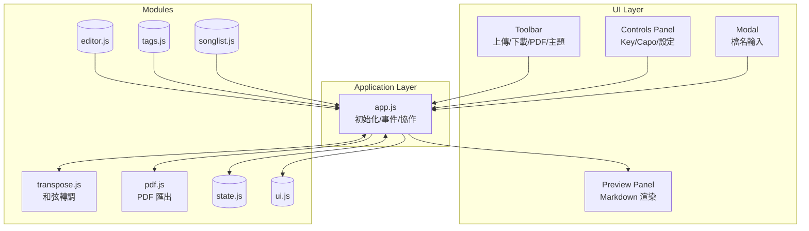
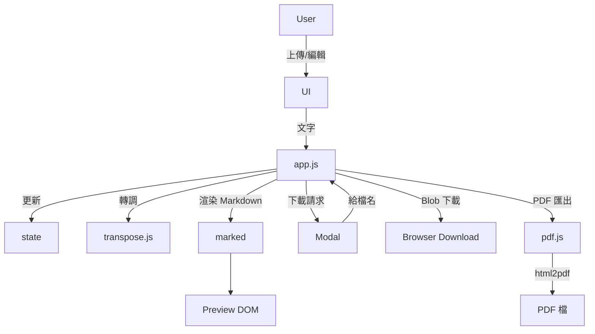
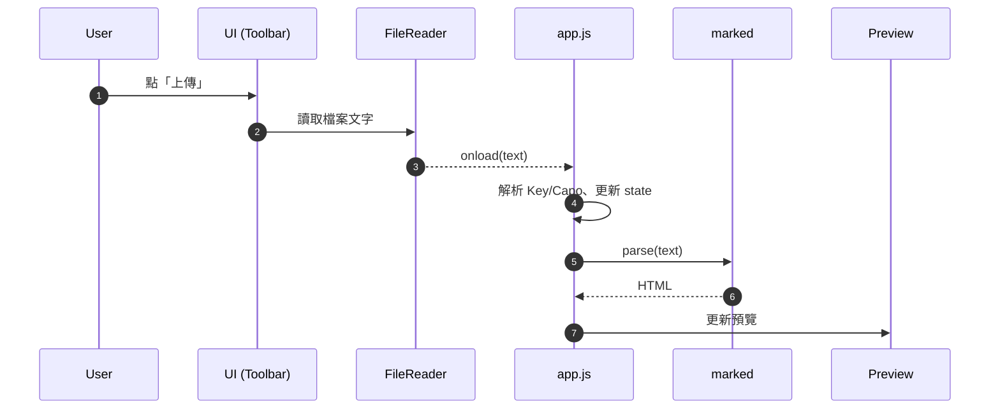
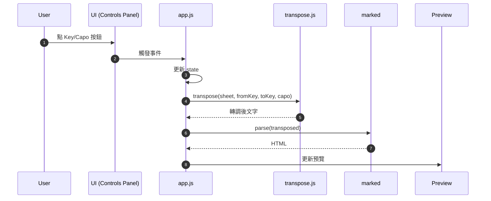
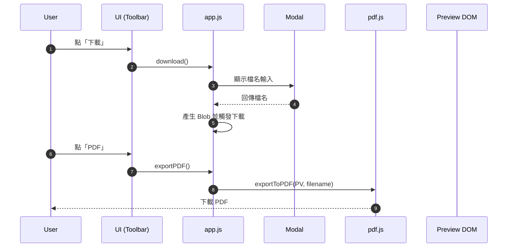
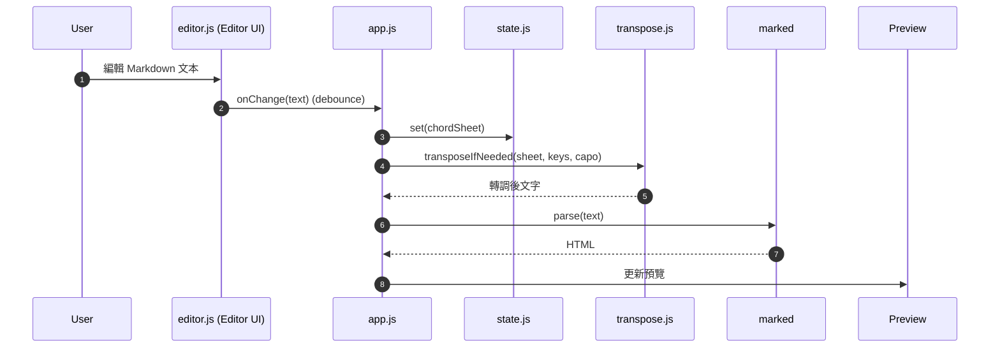
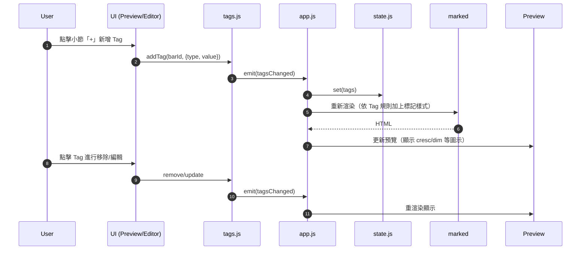
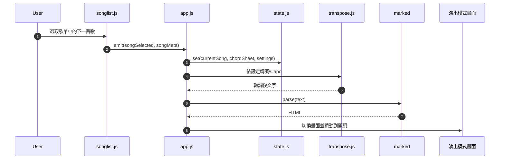

# GuitarTab 專案架構文件

本文件說明系統模組組成、資料流、與關鍵互動流程。後續將附上圖（架構圖、流程圖、循序圖）。

## 系統模組架構（Architecture Overview）
- UI Layer（index.html + styles.css）
  - Toolbar（上傳/下載/PDF/主題）
  - Controls Panel（Key/Capo/目前設定）
  - Preview Panel（Markdown 渲染）
  - Modal（檔名輸入）
- Application Layer（assets/js/app.js）
  - 初始化、事件綁定、狀態同步
  - 協調各功能模組
- Modules（assets/js/modules）
  - transpose.js：和弦轉調
  - pdf.js：PDF 匯出
  -（規劃）editor.js、tags.js、songlist.js、state.js、ui.js

### 架構圖

## 資料流程（Data Flow）
1. 使用者載入/編輯 Markdown（未來 editor.js）
2. app.js 更新 state.chordSheet → 呼叫 marked 產生 HTML → 更新 Preview
3. 切換 Key/Capo → 呼叫 transpose.js 產生轉調後文字 → 再渲染
4. 下載 Markdown → 由 app.js 彈出檔名 modal → 產生 Blob → 下載
5. 匯出 PDF → pdf.js 將 Preview DOM 輸出 PDF 檔

### 資料流程圖

## 關鍵互動循序（Sequence）

### A. 上傳檔案

### B. 切換 Key/Capo

### C. 下載與 PDF 匯出

## 非功能性需求（NFR）
- 安全：未來引入 DOMPurify 過濾 Markdown HTML
- 效能：渲染 Debounce、大檔案處理（規劃中）
- 可維護：ES Modules、單元測試（轉調核心）

## 版本策略
- step-1：樣式/腳本拆分、轉調/PDF 模組化（已完成）
- step-2：editor/renderer/state 模組化與安全渲染
- step-3：tags/songlist/演出模式
- step-4：轉調引擎強化與測試覆蓋

---

## 補充循序圖（Editor / Tags / Songlist）

### D. 樂譜編輯器互動（即時預覽）

### E. 小節 Tag 新增/移除/更新

### F. 歌序/演出模式切換

